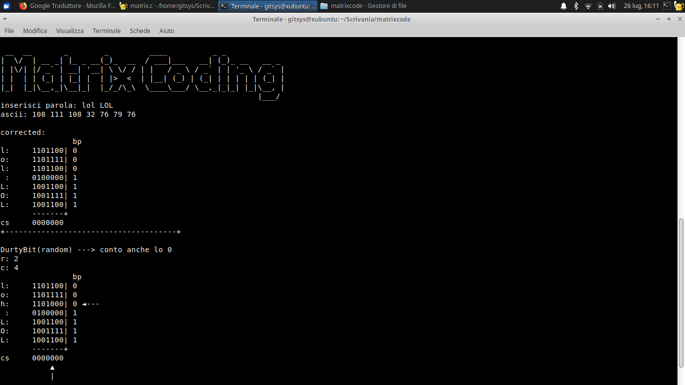
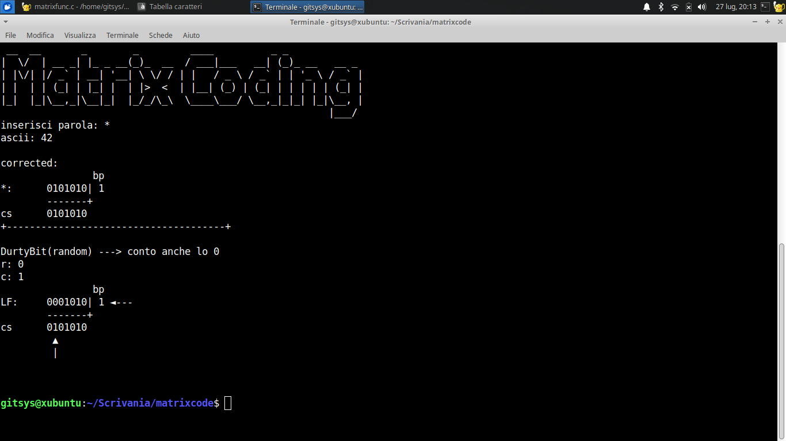

**# INSTALL DEBIAN BASED**

```shell
sudo apt install figlet
./make.sh 
```

==========================

**# INSTALL ARCH LINUX BASED**

```shell
sudo pacman -S figlet
./make.sh
```

==========================

**# INSTALL WINZZOZ 64bit**

```batch
gcc matrix.c matrixfunc.c -o matrixcompleto 
```

oppure

```batch
gcc matrix.c matrixfunc.c -o matrixcompleto -lm
```

**# INSTALL WINZZOZ 32bit**

```batch
gcc -m32 matrix.c matrixfunc.c -o matrixcompleto 
```

```batch
gcc -m32 matrix.c matrixfunc.c -o matrixcompleto -lm 
```

==========================

*photo*

<div>

</div>

<div>

</div>

<div>

</div>
